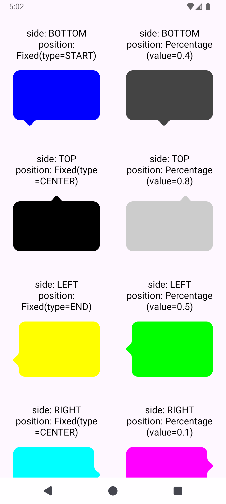

# BubbleDrawable

Bubble Drawable is a custom Android drawable that allows you to create bubble-like shapes with customizable tail side and position, side margin, colors, corner radius. It is designed to be lightweight and easy to use, making it perfect for chat bubbles, tooltips, or any other UI elements that require a bubble-like appearance.


## Features

- Config side and position
- Round corners
- Custom color
- Lightweight


## Demo


## How to use

```
bubble.background = BubbleDrawable(
    context = context,
    resId = R.drawable.ic_bubble_tail,
    color = bubbleConfig.color,
    side = BubbleTailSide.TOP,
    position = BubbleTailPosition.Percentage(0.4f),
    sideMargin = dpToPx(16f),
    cornerRadius = dpToPx(16f)
)
```
